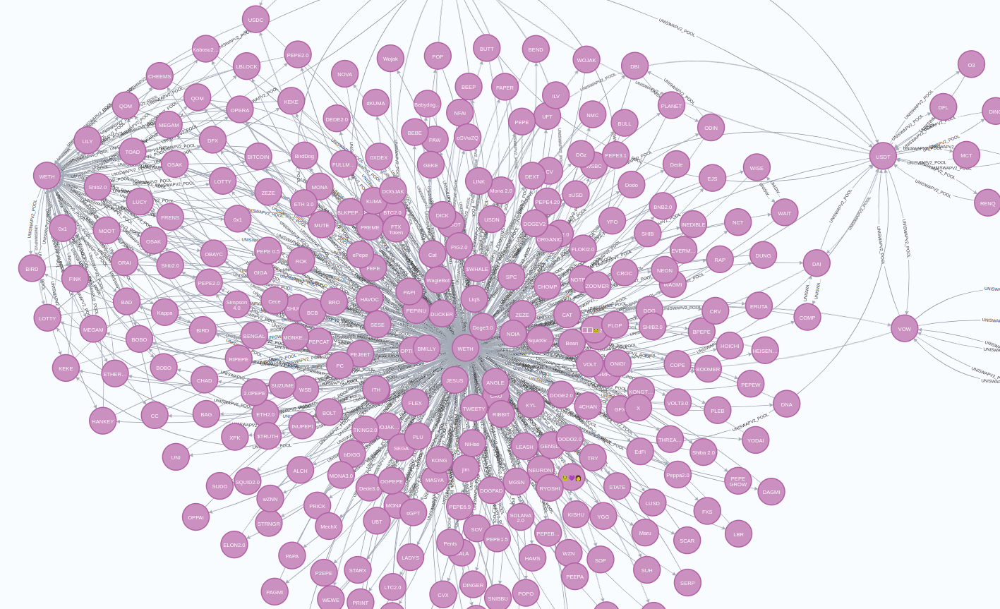

# Neo4j-pool-watcher

A uniswapv2 pool watcher using neo4j

## Usage

```bash
cargo build --release

./target/release/neo4j-pool-watcher
```

## License

[MIT](https://choosealicense.com/licenses/mit/)